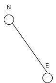

# Задача 11

## Условие

Определить знаменатель относительной погрешности длины,  вычисленной по координатам двух точек N1 = 1275.43 м, E1 = 2649.72 м и  N2 = 2753.64 м, E2 = 3149.57 м,  имеющих  погрешности  mN1 = 0.12 м, mE1 = 0.17 м и  mN2 = 0.08 м, mE2 = 0.11 м соответственно. Координата N обозначает направление на Север (North), координата E - направление на Восток (East).
## Дано
N1 = 1275.43 м            
E1 = 2649.72 м         
E2 = 3149.57 м         
mN1 = 0.12 м       
mE1 = 0.17 м          
mN2 = 0.08 м       
mE2 = 0.11 м    

## Найти
mL - ?

## Решение

Длина между двумя точками на плоскости вычисляется по формуле:

$$ L = \sqrt { (E_2-E_1)^2 + (N_2-N_1)^2 } $$

Для оценки погрешности длины воспользуемся формулой распространения погрешностей:

$$ m_{L} = \sqrt {( \left ( \frac{d_{L}}{dE_1} \right) \cdot mE_1)^2 + (\left ( \frac{d_{L}}{dN_1} \right) \cdot mN_1)^2 + (\left ( \frac{d_{L}}{dE_2} \right) \cdot mE_2)^2 + (\left ( \frac{d_{L}}{dN_2} \right) \cdot mN_2)^2 } $$

Вычисляем длину:

$$ L = \sqrt { ((3149,57 - 2649,72)^2 + (2753,64 - 1275,43)^2) } = 1006,32 м $$ 

Вычисляем частные производные:

$$ \left ( \frac{dL}{dE_1} \right) = \left ( \frac{-(E_2-E_1)}{L} \right) = -0,3967 $$

$$ \left ( \frac{dL}{dN_1} \right) = \left ( \frac{-(N_2-N_1)}{L} \right) = -0,9174 $$

$$ \left ( \frac{dL}{dE_2} \right) = \left ( \frac{(E_2-E_1)}{L} \right) = 0,3967 $$

$$ \left ( \frac{dL}{dN_2} \right) = \left ( \frac{(N_2-N_1)}{L} \right) = 0,9174 $$

Подставляя исходные данные в формулу, получим:

$$ m_{L} = \sqrt { ((-0,3967 \cdot 0,17 )^2 + (-0,9174 \cdot 0,12)^2 + (0,3967 \cdot 0,11 )^2 + (0,9174 \cdot 0,08)^2) } = 0,199 м $$

$$ \left ( \frac{mL}{L} \right) = \left ( \frac{0,199}{1006,32} \right) = 0,0002 м $$

**_Ответ_**: 0,0002 м
